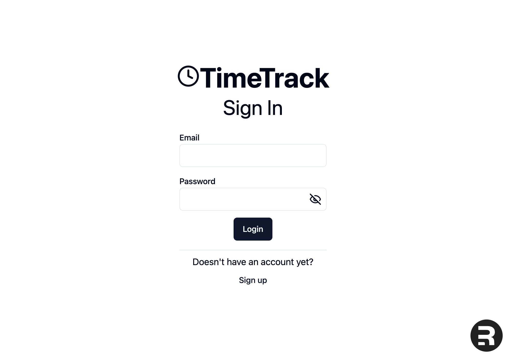
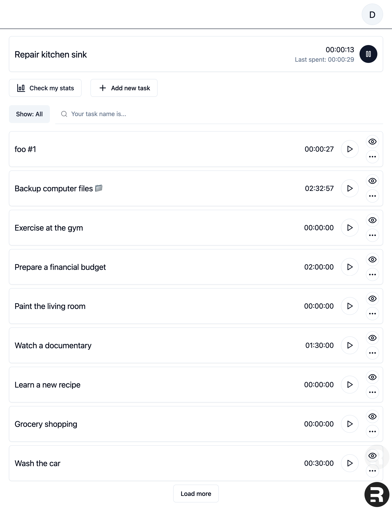
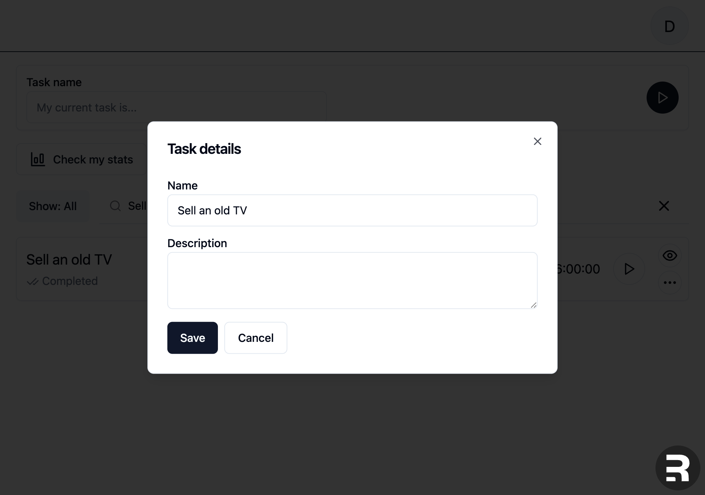
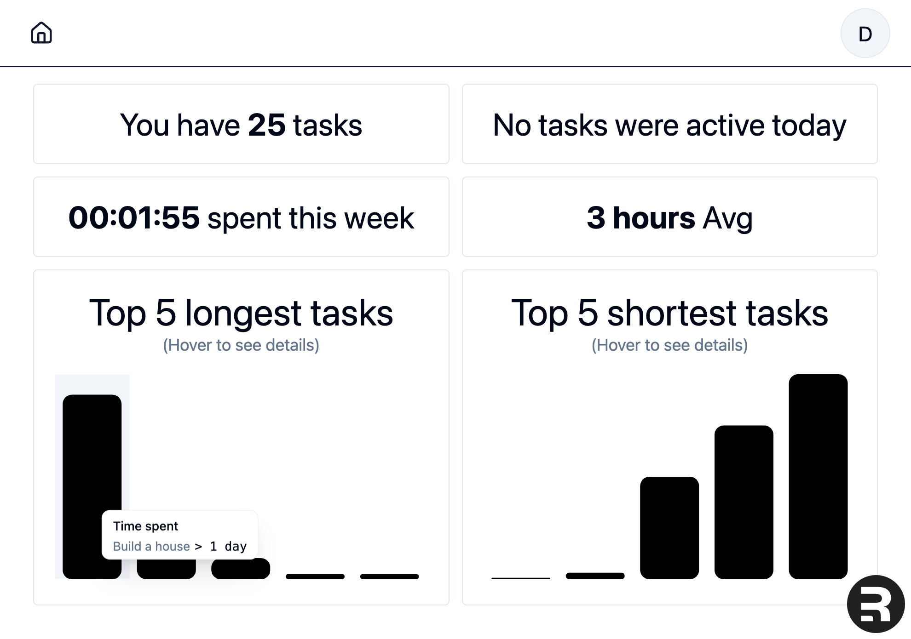
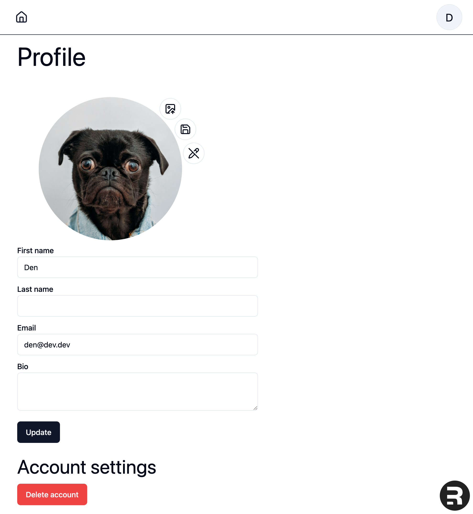

# Time tracker

A simple web-based time-tracking demo application designed to help users
efficiently monitor and manage their time spent on tasks.

<div>





</div>

## Technologies Used

- Frontend: Typescript, Remix, Tailwindcss, Shadcn/ui
- Backend: Typescript, Nodejs, Express, Postgresql, Prisma, AWS S3, Docker, Postman
- Testing: Jest, Playwright
- Code quality: Eslint, Prettier

## Installation

```sh
git clone https://github.com/denlahodnyi/time-tracker.git
cd time-tracker
pnpm install
```

## Development

[Backend preparation](apps/backend/README.md)

To start backend and frontend run

```sh
pnpm dev
```

## E2E tests

[Details](e2e/README.md)

## TODO

- [x] add ability to mark as "Done"
- [x] add search and filters
- [x] add analytics
- [ ] add projects
- [ ] add teams
- [x] add E2E tests
